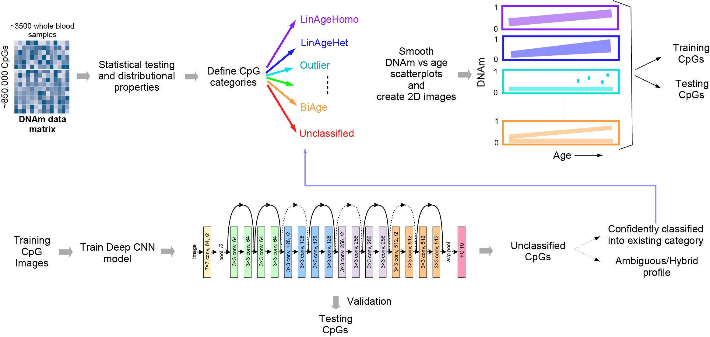

# A deep-learning driven taxonomy of the aging methylome reveals novel insights into age-related diseases
Starting out from an EPICv1 DNAm dataset of approximately 3500 whole blood samples and over 811,870 CpGs,we used statistical criteria to define an initial list of CpG categories or taxa, each one characterized by a particular age or non age-dependent DNAm pattern. DNAm scatterplots against age were transformed into 2-dimensional images, and CpGs split into a training and a test set. The 2D images of the training set were then used as input to a deep convolutional neural network (ResNet18) to learn features that distinguish the different patterns from each other. The resulting ResNet18 predictor was then validated on the independent test set. Application of this predictor to originally ‘unclassified’ CpGs allowed re-assignment of these into various categories, thus allowing for an iterative procedure which sequentially assigns more CpGs to various CpG categories. 



<!-- Operating system -->
## Operating system

+ Linux system

<!-- Softeware requirements -->
## Software requirements
+ Python = 3.12.9


<!-- Softeware requirements -->
## Package requirements
Python: torch 2.5.1, pandas 2.2.3, torchvision 0.20.1, numpy 2.0.1, Pillow 11.1.0

<!-- Softeware Installation -->
## Installation

1.  **Clone the repo**
    ```sh
    git clone https://github.com/Duzhaozhen/AgeTaxoDeepL.git
    cd AgeTaxoDeepL
    ```

2.  **Create and activate the conda environment**
    This command will create a new conda environment named `AgeTaxoDeepL` using the provided `environment.yml` file.
    ```sh
    conda env create -f environment.yml
    conda activate AgeTaxoDeepL
    ```


<!-- Usage -->
## Usage

### Step 1: Data preparation
+ `training_info.csv`: Training set for the ResNet18 model, two columns, the first column is the path of the CpG image and the second column is the corresponding category.
+ `val_info.csv`: Validation set of the ResNet18 model in the same format as the training set.
+ `test_info.csv`: Test set of the ResNet18 model in the same format as the training set.
+ `CpG_image`: The folder for storing all CpG images.

### Step 2: Training Models
Train ResNet18 model or MixResNet18 model
To train the model, run one of the following notebooks:
* `Training_ResNet18.ipynb`: Trains the standard ResNet18 model.
* `Training_MixResNet18.ipynb`: Trains the MixResNet18 model.
#### Input:

+ `training_info.csv & val_info.csv`: Training set and validation set.

#### Output:

+ `{ModelName}_best_model.pt`: Contains the optimal model weighting parameters.
+ `{ModelName}_normalization_stat.json`: Stores the mean and standard deviation of the training set.
+ `{ModelName}_training_log.csv`: The log file generated during model training.
### Step 3: Prediction
Run the `Prediction_ResNet18.ipynb` notebook to generate predictions.
#### Input:
+ `test_info.csv`: Test set.
+ `{ModelName}_best_model.pt`: Trained optimal model.
+ `{ModelName}_normalization_stat.json`: Mean and standard deviation of the training set.
#### Output:

+ `{ModelName}_predictions.csv`: Prediction categories for CpGs in the test set.

