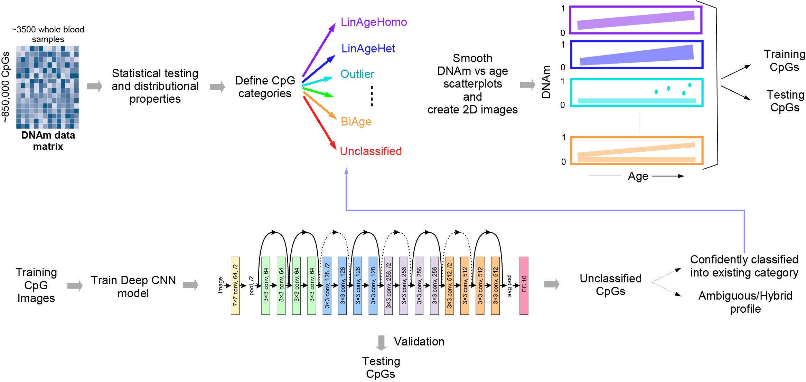

# A deep-learning driven taxonomy of the aging methylome reveals novel insights into age-related diseases



<!-- TABLE OF CONTENTS -->
<details open="open">
  <summary><h2 style="display: inline-block">Table of Contents</h2></summary>
  <ol>
    <li><a href="#Operating system">Operating system</a></li>
    <li><a href="#usage">Usage</a></li>

  </ol>
</details>

<!-- Operating system -->
## Operating system

+ Linux system

<!-- Softeware requirements -->
## Softeware requirements
+ Python = 3.12.9


<!-- Softeware requirements -->
## Softeware requirements
Python: torch 2.5.1, pandas 2.2.3,torchvision 0.20.1, numpy 2.0.1, Pillow 11.1.0

<!-- Usage -->
## Usage

### Step 1: Data preparation
+ `training_info.csv`: Training set for the ResNet18 model, two columns, the first column is the path of the CpG image and the second column is the corresponding category
+ `val_info.csv`: Validation set of the ResNet18 model in the same format as the training set
+ `test_info.csv`: Test set of the ResNet18 model in the same format as the training set
+ `CpG_image` : The folder for storing all CpG images

### Step 2: Training Models
Train ResNet18 model or MixResNet18 model
```
Training_ResNet18.ipynb | Training_MixResNet18.ipynb
```
#### Input:

+ `training_info.csv & val_info.csv`: Training set and validation set

#### Output:

+ `{modelName}_best_model.pt`: The optimal model weighting parameters.
+ `{modelName}_normalization_stat.json`: Mean and standard deviation of the training sets.
+ `{modelName}_training_log.csv`: Log file of model training
### Step 3: Prediction

```
Prediction_ResNet18.ipynb
```
#### Input:
+ `test_info.csv`: Test set
+ `{modelName}_best_model.pt`: Trained optimal model
+ `{modelName}_normalization_stat.json`: Mean and standard deviation of the training sets.
#### Output:

+ `{dataName}_best_model.pt` : Prediction categories for the test set CpG

